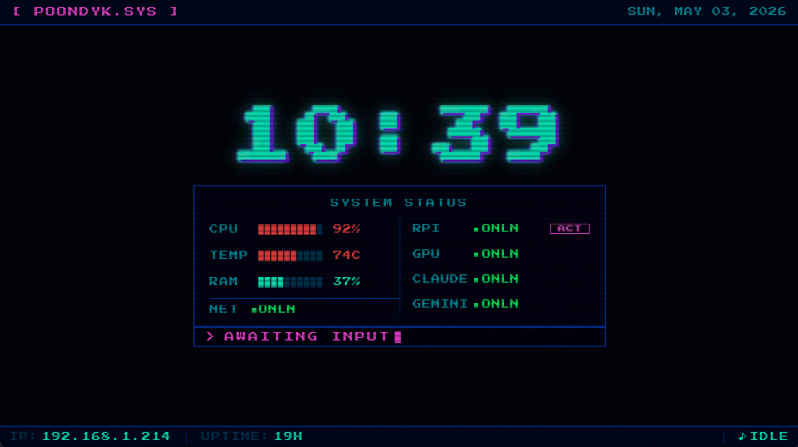
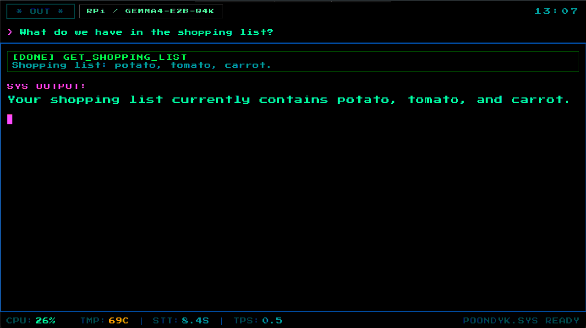

# Voice Assistant — RPi 5 Home Lab

> Local-first voice assistant with smart cloud fallback, running on Raspberry Pi 5.





---

## Features

- **Wake word** detection (custom openWakeWord model)
- **Local STT** via faster-whisper — no cloud, no latency
- **Smart LLM routing** — local llama.cpp → remote Ollama GPU → Claude / Gemini fallback
- **Streaming TTS** — Piper synthesizes sentence-by-sentence while the LLM is still generating
- **Tool calling** — weather, web search, timers, internet radio, shopping list, recipes, memory
- **Retro terminal UI** — PyQt6 display for Raspberry Pi Touch Display 2 (800×480)
- **Session memory** — per-session summaries in SQLite, persistent user facts in Markdown

---

## Architecture

```
Mic → Wake Word (openWakeWord) → STT (faster-whisper)
   → Router → LLM (Ollama local / Claude / Gemini)
   → Tool Executor → Streaming TTS (Piper) → Speaker
```

### State Machine

```
                    ┌──────────┐
          Ctrl+C    │ SHUTDOWN │
         ┌─────────→│          │
         │          └──────────┘
         │
    ┌────┴───┐   wake / key / text   ┌───────────────┐
    │  IDLE  │──────────────────────→│ SESSION_CHECK  │
    └────────┘                       └───┬───────┬────┘
         ↑                               │       │
         │                          text input  otherwise
         │                               │       │
         │                               ↓       ↓
         │                       ┌──────────┐  ┌───────────┐
         │       no speech       │ THINKING │←─│ LISTENING  │
         │       ┌───────────────│          │  └───────────┘
         └───────┘               └──────────┘
                                      │ done
                                      └→ IDLE
```

| State | What happens | Mic |
|---|---|---|
| IDLE | Wait for trigger (wake word / Enter / text) | Wake detector |
| SESSION_CHECK | Check inactivity timeout, rotate session | — |
| LISTENING | Record + transcribe with faster-whisper | arecord |
| THINKING | Route → LLM + tool loop (max 2 rounds) + streaming TTS | — |
| SHUTDOWN | Close session, exit | — |

---

## Prerequisites

- **Python 3.13+**
- **`uv`** — fast Python package manager ([install](https://docs.astral.sh/uv/getting-started/installation/))
- **System packages:**
  ```bash
  sudo apt-get install alsa-utils espeak-ng mpv
  ```
- **At least one LLM backend:**

  | Backend | How to enable |
  |---|---|
  | Remote Ollama (GPU PC) | Running at `192.168.1.74:11434` |
  | Local llama.cpp (RPi) | Running at `localhost:8080` |
  | Claude | `ANTHROPIC_API_KEY` in `.env` |
  | Gemini | `GOOGLE_API_KEY` in `.env` |

- **Optional integrations:** `TODOIST_API_TOKEN` + `TODOIST_PROJECT_ID` (shopping list), `NOTION_API_KEY` + `NOTION_RECIPES_DB_ID` (recipe lookup)

---

## Installation

### 1. Clone and setup

```bash
git clone <repo-url>
cd voice_assistant
bash scripts/setup.sh
```

### 2. Restore gitignored files

These files are not in the repo — copy from backup or create fresh:

| File | Purpose | How to restore |
|---|---|---|
| `.env` | API keys | See template below |
| `models/*.onnx` | Custom wake word model | Copy from backup |
| `memory/USER.md` | User facts / preferences | Copy from backup or let the assistant recreate it |

```bash
# Minimum .env to get started
echo "ANTHROPIC_API_KEY=sk-ant-..." >> .env
echo "GOOGLE_API_KEY=..."          >> .env
```

### 3. Install systemd service

```bash
bash scripts/va install --ui    # with touch display UI
bash scripts/va install         # headless / wake word only
sudo systemctl start voice-assistant-ui
```

### 4. Verify

```bash
uv run scripts/test_components.py all
```

---

## Quick Start

```bash
uv run python -m src.main                        # Wake word mode
uv run python -m src.main --no-wake              # Keyboard trigger (press Enter to speak)
uv run python -m src.main --text                 # Text-only (no audio)
uv run python -m src.main --ui --no-wake         # With retro terminal UI
uv run python -m src.main --ui --no-wake --windowed  # Dev: 800×480 window
```

---

## Model Routing

The router selects the best available backend automatically:

| Trigger | Backend |
|---|---|
| Default (preferred backend healthy) | Configured preferred (default: remote Ollama) |
| Default (preferred unreachable) | Local llama.cpp — always available |
| "Use Claude / ask Claude" | Claude — sticky for session |
| "Use Gemini / ask Gemini" | Gemini — sticky for session |
| "Use GPU / use remote" | Remote Ollama — sticky for session |
| "Use local / go offline" | Local llama.cpp — sticky for session |
| "Go back to automatic" | Auto — clears session preference |

`BackendHealthMonitor` (`src/health.py`) polls all backends continuously (remote every 60 s, cloud every 5 min). If you explicitly request a backend and it fails, the assistant voices the error and resets to automatic routing.

---

## Tools

| Tool | Data source |
|---|---|
| Weather (current + forecast) | Open-Meteo (free, no key) |
| Web search | DuckDuckGo (free, no key) |
| Time / date (any timezone) | System + geocoding |
| Shopping list (add + view) | Todoist API |
| Timers (set + cancel) | Background thread |
| Internet radio (play + stop + volume) | Radio Browser API + mpv |
| Recipe lookup | Notion family recipe DB |
| Remember / recall | Markdown files + SQLite |

---

## Project Structure

```
voice-assistant/
├── config/config.yaml         # All configuration
├── memory/
│   ├── PERSONA.md             # Assistant identity + tool instructions
│   └── USER.md                # User preferences + facts (written by remember tool)
├── src/
│   ├── main.py                # Entry point + run_llm_with_tools
│   ├── state_machine.py       # FSM: states, transitions, orchestration
│   ├── config.py              # Config loader (YAML + VA_ env overrides)
│   ├── health.py              # BackendHealthMonitor
│   ├── audio.py               # ALSA device detection + arecord streaming
│   ├── monitor.py             # CPU/RAM/temp tracking + latency records
│   ├── wake_word/detector.py  # openWakeWord integration
│   ├── stt/engine.py          # faster-whisper STT
│   ├── llm/backends.py        # Ollama, llama.cpp, Claude, Gemini backends
│   ├── router/router.py       # Model selection logic
│   ├── tools/
│   │   ├── executor.py        # Tool schemas + dispatch
│   │   ├── player.py          # Internet radio via mpv
│   │   ├── recipes.py         # Notion recipe library
│   │   └── timers.py          # Countdown timers
│   ├── tts/engine.py          # Piper streaming TTS
│   └── ui/                    # PyQt6 retro terminal UI (--ui flag)
├── scripts/
│   ├── setup.sh               # One-time setup
│   └── test_components.py     # Component tests
├── voices/                    # Piper voice models (.onnx)
├── models/                    # Wake word models (.onnx)
└── pyproject.toml
```

---

## Configuration

Edit `config/config.yaml` or override with `VA_`-prefixed environment variables:

```bash
VA_LLM_LOCAL_MODEL=qwen3:1.7b uv run python -m src.main   # smaller model
VA_STT_MODEL=tiny.en uv run python -m src.main             # faster STT
VA_LLM_PREFERRED_BACKEND=local uv run python -m src.main   # always use local
VA_WAKE_WORD_THRESHOLD=0.6 uv run python -m src.main       # stricter wake word
```

Key config values:
- `llm.preferred_backend` — default backend when no session preference is set (`"remote"` or `"local"`, default `"remote"`)
- `stt.model` — whisper model size (`tiny.en`, `base.en`, `small.en`)
- `wake_word.threshold` — detection sensitivity (lower = more sensitive)

---

## Development

```bash
# Lint + format
uv run ruff check src/
uv run ruff format src/

# Component tests
uv run scripts/test_components.py all
uv run scripts/test_components.py weather   # single component

# View logs
tail -f data/logs/assistant.log
```

---

## Resource Budget (RPi 5, 16 GB)

| Component | RAM | CPU |
|---|---|---|
| OS + services | ~1 GB | — |
| Ollama (qwen3:4b) | ~3–4 GB | 100% during inference |
| faster-whisper (base.en) | ~0.5 GB | burst |
| openWakeWord | ~50 MB | ~5% continuous |
| Piper TTS | ~100 MB | burst |
| n8n | ~0.5 GB | mostly idle |
| **Headroom** | **~10 GB** | room to grow |

---

## Reinstall / Recovery

```bash
cd ~/Projects

# Back up gitignored files first
cp voice_assistant/.env /tmp/va.env 2>/dev/null || true
cp -r voice_assistant/models /tmp/va-models 2>/dev/null || true
cp voice_assistant/memory/USER.md /tmp/va-user.md 2>/dev/null || true

# Fresh clone
mv voice_assistant voice_assistant.bak
git clone <repo-url> voice_assistant
cd voice_assistant

# Restore gitignored files
cp /tmp/va.env .env
cp /tmp/va-models/*.onnx models/ 2>/dev/null || true
cp /tmp/va-user.md memory/ 2>/dev/null || true

# Setup + reinstall service
bash scripts/setup.sh
bash scripts/va install --ui
sudo systemctl start voice-assistant-ui
```
